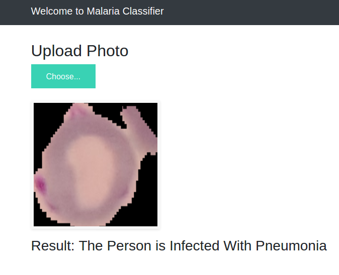

# Malaria Detection
This project is developed for detecting the malaria infection based on CNN image classifier trained on Tensorflow Keras. It is deployed into Heroku using Flask. Please click [here](https://malaria-detection-abhi.herokuapp.com/) to redirect to the project.

## 1. Development Environment
-Python 3.8

__Step 1: Install the dependencies__

Install the dependencies.

    pip install -r requirements.txt

__Step 2: Dowload the model__

Download the trained model from [here](https://drive.google.com/file/d/1BnWkmo49FdSPUImq1U-JHJFOQ21VIC5S/view?usp=sharing)

__Step 3: Run the app.py__

Run the python program app.py

__Step 4: Run the url in browser__

Run the local server url generated by app.py in the browser.

    - Running on http://127.0.0.1:5000/ (Press CTRL+C to quit)
    
__Step 5: Upload the image__

Upload the image in the browser to get the prediction.
    

    

